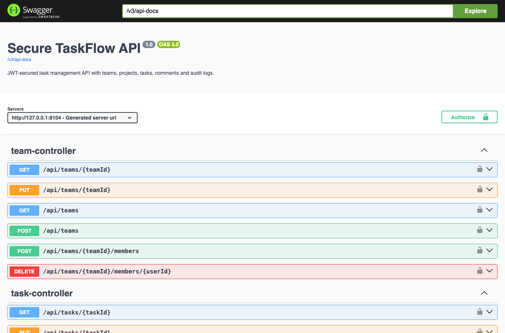
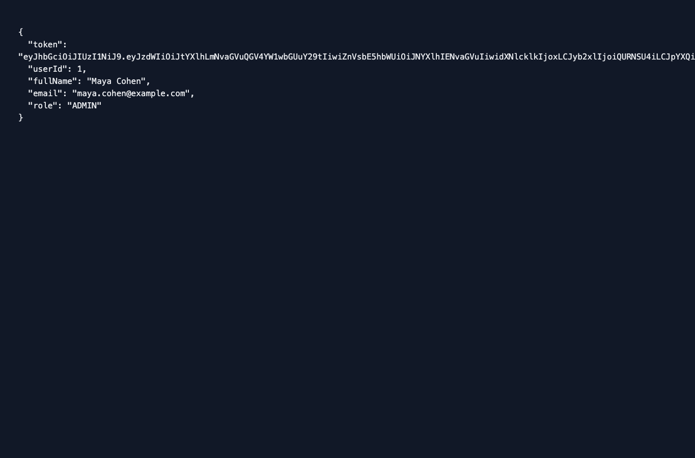
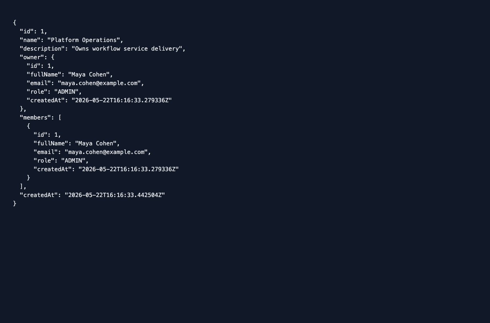
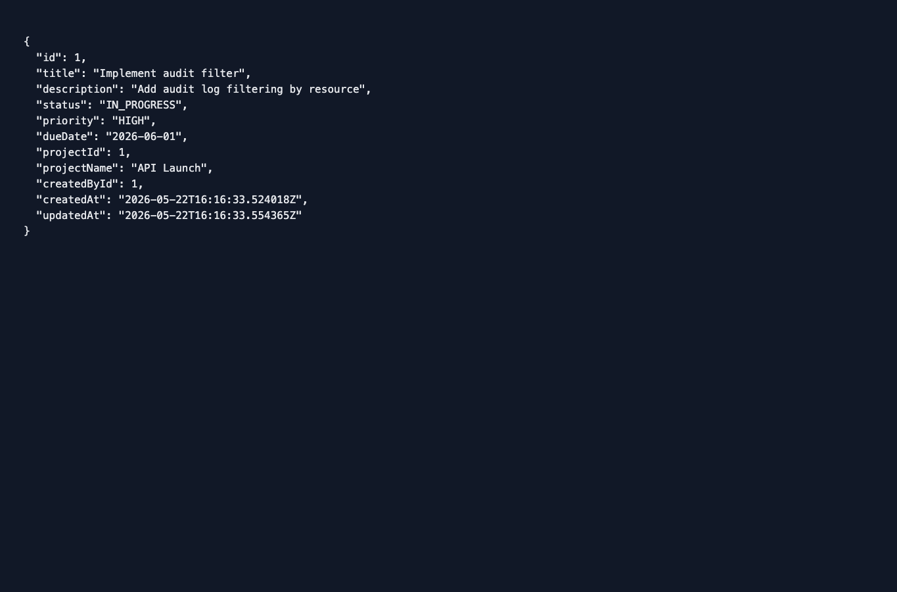

# Secure TaskFlow API

Secure TaskFlow is a Spring Boot REST API for teams, projects, tasks, comments, role-based permissions, JWT authentication, and audit logging.

## Requirements

- Java 17
- Maven 3.9 or the included `./mvnw`
- Docker Desktop for the bundled PostgreSQL service

## Run Locally

```bash
docker compose up -d postgres
./mvnw spring-boot:run
```

Swagger UI is available at `http://localhost:8080/swagger-ui.html`.

Run tests:

```bash
./mvnw test
```

## Screenshots

These screenshots are from the running Spring Boot API: Swagger UI plus real JSON responses returned by the authentication, team, task, and audit endpoints.

To reproduce the same views:

```bash
docker compose up -d postgres
./mvnw spring-boot:run
```

Open `http://localhost:8080/swagger-ui.html`, then run the example requests in `requests.http` or the `curl` flow below.










## Domain

- Users register and receive a JWT.
- Team owners and managers add members.
- Managers create projects under teams.
- Members create tasks, change status, and add comments.
- Admins inspect audit logs.

## Main Endpoints

| Area | Endpoints |
|---|---|
| Auth | `POST /api/auth/register`, `POST /api/auth/login` |
| Users | `GET /api/users/me`, `GET /api/users`, `PATCH /api/users/{userId}/role` |
| Teams | `POST /api/teams`, `GET /api/teams`, `POST /api/teams/{teamId}/members` |
| Projects | `POST /api/projects`, `GET /api/projects`, `PUT /api/projects/{projectId}` |
| Tasks | `POST /api/tasks`, `GET /api/tasks`, `PATCH /api/tasks/{taskId}/status`, comments |
| Audit | `GET /api/audit-logs` |

## Example Request

```bash
curl -X POST http://localhost:8080/api/auth/register \
  -H "Content-Type: application/json" \
  -d '{"fullName":"Maya Cohen","email":"maya.cohen@example.com","password":"password123","role":"ADMIN"}'
```

Use the returned token as a bearer token for protected endpoints.

Create a team, project, task, status update, and audit-log response:

```bash
curl -X POST http://localhost:8080/api/teams \
  -H "Authorization: Bearer $TOKEN" \
  -H "Content-Type: application/json" \
  -d '{"name":"Platform Operations","description":"Owns workflow service delivery"}'
```

Continue with `requests.http` for project creation, task creation, status transition, and `GET /api/audit-logs`.

## Implementation Notes

```text
Spring Boot 3
Spring Security with JWT
Spring Data JPA with PostgreSQL
H2-backed integration tests
Swagger/OpenAPI via springdoc
Docker Compose for local database startup
```

Keywords: java, spring boot, spring security, jwt, postgresql, rest api, docker, swagger, junit
